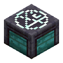

# PrimeSlots

Zeigt dein ausgerüstetes Relikt-Set dauerhaft auf dem Bildschirm — damit du nicht ständig `/slots`
aufmachen musst, um zu sehen was du eigentlich anhast.

**Nur für PrimeBlocks.** Auf anderen Servern macht der Mod gar nichts.



## Was du siehst

```
Money (Set II)
  d20 VI  d12 VI  d6 V  d0 VI
  d20+d12: +10,0% Job Münzen, -40,0% Job XP
  d6+d0: +5,0% Shiny-Chance
  Werte
      +21,2% Job Münzen
      -12,0% Größe
      +10,5% Regeneration
      …
```

Dein Set-Name, die vier Relikte, beide Synergien und darunter die **effektiven Gesamtwerte** —
also was am Ende wirklich bei dir ankommt, alles zusammengerechnet.

Wechselst du das Set, ändert sich die Anzeige mit. Wechselst du den CityBuild, auch.

## Einrichtung

Keine. Mod in den `mods`-Ordner, fertig.

Beim ersten Mal auf PrimeBlocks erscheint im Chat eine Zeile zum Anklicken:

```
[PrimeSlots] Einmalige Freischaltung — ein Klick:
   [ /login 1234 ]
```

Draufklicken — das war's. Der Mod merkt sich das, auch nach einem Neustart. Es gibt keine Befehle,
die du dir merken musst.

## Tasten

| Taste | |
|---|---|
| **F6** | Anzeige verschieben und einstellen |
| **F7** | Anzeige an/aus |

Beide sind nur Vorgaben — umstellen kannst du sie ganz normal unter
**Optionen → Steuerung → Sonstiges**.

Im Einstellungsfenster (F6) ziehst du die Anzeige mit der Maus dorthin, wo du sie haben willst.
Größe änderst du mit Links-/Rechtsklick auf den Größe-Knopf. Darüber schaltest du ein und aus, was
angezeigt werden soll: Hintergrund, Relikte, Einzelwerte, Synergien, Gesamtwerte, und ob Mali
mit angezeigt werden. Esc speichert.

## Voraussetzungen

Minecraft **26.2**, Fabric Loader und Fabric API. Die Jar heißt nach der Minecraft-Version, für die
sie gebaut ist: `primeslots-26.2.jar`.

---

## Für Entwickler

<details>
<summary>Technische Details</summary>

### Datenquellen

| | Quelle | liefert |
|---|---|---|
| API | `/api/relic/{db}/me` | alle Sets, Relikte, Stats — und `active` |
| `/slots`-Menü | Container-Inhalt | die Set-Namen, die es sonst nirgends gibt |

Gelesen wird ausschließlich über den authentifizierten Endpoint. Den unauthentifizierten
Debug-Endpoint nutzt der Mod nicht — er ist laut API-Doku „intended for debugging only".

Das `active`-Flag kam am 28.07.2026 dazu. Davor war das Auslesen des Menüs die einzige Möglichkeit,
das getragene Set zu bestimmen; daher stammt der Container-Parser in `tracking/`.

### CityBuild-Erkennung

Die einzige Stelle, an der PrimeBlocks den Server nennt, ist die **Tab-Fußzeile**: „Du befindest
dich derzeit auf: CityBuild-1 (Farmwelt-5)". Weder Scoreboard noch Dimensionsname noch Serveradresse
unterscheiden die CityBuilds. `PlayerTabOverlay.footer` ist privat, deshalb liest ein
Mixin-Accessor sie aus.

Bewusst *nicht* implementiert: „nimm die Datenbank, in der Daten liegen". Wer auf CB2 steht und nur
auf CB1 Relikte hat, bekäme sonst unauffällig die falschen Sets angezeigt.

Der Gang in eine Farmwelt ist ein vollständiger Reconnect, bei dem die Fußzeile erst Sekunden
später eintrifft. Deshalb wird beim Join nichts zurückgesetzt, und das zuletzt gesehene Set wird
pro CityBuild gemerkt.

### Werte

Stat-Tabelle und alle 21 Form-Paar-Synergien stammen aus dem
[Relikt-System-Wiki](https://wiki.primeblocks.net/de/citybuild/relikt-system). Aus echten
Menü-Dumps abgeleitet und gegen die Anzeige des Servers verifiziert:

* **Mali sind 1,5× der Bonuswerte.** Das Wiki tabelliert nur die Bonus-Seite.
* Anzeigeformat: deutsches Dezimalkomma, eine Nachkommastelle, Stufe 0 ohne römische Ziffer.
* Das „Relikt-Werte"-Panel wird exakt reproduziert, inklusive Sortierung (Boni vor Mali,
  Prozent- vor Flat-Stats, dann absteigende Magnitude, Gleichstand nach Stat-ID).

### Aktualisierung

| Situation | Intervall |
|---|---|
| `/slots` offen | 1 s (`menuRefreshMillis`) |
| nach dem Schließen | einmalig nach 750 ms |
| sonst | 60 s (`refreshIntervalSeconds`) |

### Dateien

* `config/primeslots.json` — Anzeigeeinstellungen (wird vom F6-Fenster geschrieben)
* `config/primeslots-auth.json` — **API-Token, nicht weitergeben.** Bewusst getrennt von der
  Config, denn die ist die Datei, die man bei Problemen irgendwo hineinkopiert. Tokens liegen nach
  Spieler-UUID getrennt.

Wird das Token abgelehnt (401/403) oder ist sein `exp` abgelaufen, verwirft der Mod es und bietet
beim nächsten Join eine neue Freischaltung an.

### Bauen

Minecraft 26.2 braucht **Java 25**:

```bash
./gradlew build
```

Ergebnis: `build/libs/primeslots-26.2.jar`.

Ab 26.x liefert Mojang die Jars **unobfuskiert** — daher kein `mappings`-Eintrag in `build.gradle`,
Plugin-ID `net.fabricmc.fabric-loom`, `implementation` statt `modImplementation`, kein `remapJar`.
HUD-Rendering läuft über `HudElement.extractRenderState(GuiGraphicsExtractor, DeltaTracker)`, der
offene Screen hängt an `Minecraft.gui.screen()`.

Für die nächste Minecraft-Version reichen drei Zeilen in `gradle.properties`:
`minecraft_version`, `fabric_api_version` (siehe [fabricmc.net/develop](https://fabricmc.net/develop))
und `mod_version`. Zweiter Build gegen dieselbe Version: Zähler anhängen (`26.2.1`).

### CI

`.github/workflows/build.yml` baut bei Push auf `main`, bei Pull Requests und auf Knopfdruck. Ein
Tag `v*` erzeugt zusätzlich ein Release mit der Jar im Anhang.

</details>
